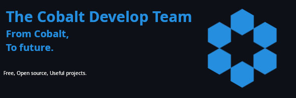

# The Cobalt Develop Team

From cobalt, to future.

# Main Developers

Owner: `Andy Shen <andyshen2006@foxmail.com>`

Administrator: `Renatus Madrigal <listener1381@outlook.com>`

# Projects

## [Cobalt](https://github.com/The-Cobalt-Develop-Team/cobalt)

### Description

A compiler for cobalt language.

### Status

Maintained

### Administrator

Andy Shen `<andyshen2006@foxmail.com>`

Renatus Madrigal `<listener1381@outlook.com>`

## [Krypton](https://github.com/The-Cobalt-Develop-Team/krypton)

### Description

An encrypter for security.

### Status

Active

### Administrator

Renatus Madrigal `<listener1381@outlook.com>`

## [Phosphorus](https://github.com/The-Cobalt-Develop-Team/phosphorus)

### Description

A physics engine.

### Status

Obsolete

### Administrator

Andy Shen `<andyshen2006@foxmail.com>`

## [Phosphine](https://github.com/The-Cobalt-Develop-Team/phosphine)

### Description

A physics engine by haskell.

### Status

Maintained

### Administrator

Andy Shen `<andyshen2006@foxmail.com>`

## [Lithium](https://github.com/The-Cobalt-Develop-Team/lithium)

### Description

A Logger System.

### Status

Odd Fixes

### Administrator

Andy Shen `<andyshen2006@foxmail.com>`

## [Radon](https://github.com/The-Cobalt-Develop-Team/radon)

### Description

A random library forked from [cdg](https://github.com/AndyShen2006/cdg).

### Status

Odd Fixes

### Administrator

Andy Shen `<andyshen2006@foxmail.com>`
